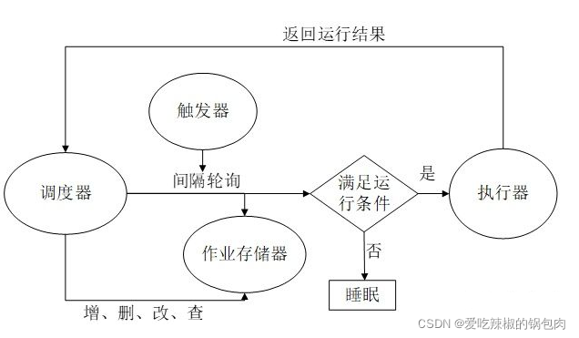

# APSchedular
## 一、基本概念
APScheduler全称Advanced Python Scheduler 作用为在指定的时间规则执行指定的作业。
方式:间隔多久执行，指定日期时间的执行，也可以类似Linux系统中Crontab中的方式执行任务。
指定的任务就是一个Python函数。
### 1.1、 触发器：triggers
用于设定触发任务的条件: 触发器包含调度逻辑。每个任务都有自己的触发器，用于确定何时应该运行作业。
除了初始配置之外，触发器完全是无状态的
### 1.2、作业存储器:job stores
用于存放任务，把任务存放在内存或数据库中
默认情况下，任务存放在内存中。也可以配置存放在不同类型的数据库中。如果任务存放在数据库中，那么任务的存取有一个序列化和反序列化的过程，同时修改和搜索任务的功能也是由任务储存器实现。
注意一个任务储存器不要共享给多个调度器，否则会导致状态混乱
### 1.3、执行器 executors
用于执行任务，可以设定执行模式为单线程或线程池：任务会被执行器放入线程池或进程池去执行，
执行完毕后，执行器会通知调度器。

### 1.4、调度器 schedulers
把上方三个组件作为参数，通过创建调度器实例来运行:一个调度器由上方三个组件构成，\
一般来说，一个程序只要有一个调度器就可以了。开发者也不必直接操作任务储存器、执行器以及触发器，\
因为调度器提供了统一的接口，通过调度器就可以操作组件，比如任务的增删改查。



## 二、调度器详解
BlockingScheduler : 阻塞式调度器：适用于只跑调度器的程序。 看成是单线程，如果在程序中仅仅只运行定时任务，那么就应该选择阻塞式调度器。
BackgroundScheduler: 后台调度器：适用于非阻塞的情况，调度器会在后台独立运行。看成是多线程，如果在程序中除了运行定时任务，咱们还想同时做点别的计算啥的，那就应该选择后台调度器。
AsyncIOScheduler : AsyncIO调度器，适用于应用使用AsnycIO的情况。
GeventScheduler : Gevent调度器，适用于应用通过Gevent的情况。
TornadoScheduler: Tornado调度器，适用于构建Tornado应用。
TwistedScheduler:Twisted调度器，适用于构建Twisted应用。
QtScheduler: Qt调度器，适用于构建Qt应用。

### 2.1、APScheduler有三种内置的触发器
date:日期：触发任务运行的具体日期
interval: 间隔：触发任务运行的时间间隔
cron: 周期：触发任务运行的周期
### 2.2、触发器公共参数
id:启动任务的ID具有唯一性\
name： 设置启动任务的名称\
coalesce :当由于某种原因导致某个job积攒了好几次没有实际运行\
（比如说系统挂了5分钟后恢复，有一个任务是每分钟跑一次的，
按道理说这5分钟内本来是“计划”运行5次的，但实际没有执行），\
如果coalesce为True，下次这个job被submit给executor时，只会执行1次，也就是最后这次，\
如果为False，那么会执行5次（不一定，因为还有其他条件，看后面misfire_grace_time的解释）\

max_instance: 就是说同一个job同一时间最多有几个实例再跑，比如一个耗时10分钟的job，
被指定每分钟运行1次，如果我们max_instance值为5，那么在第6~10分钟上，新的运行实例不会被执行，
因为已经有5个实例在跑了\

misfire_grace_time:设想和上述coalesce类似的场景，如果一个job本来14:00有一次执行，
但是由于某种原因没有被调度上，现在14:01了，这个14:00的运行实例被提交时，
会检查它预订运行的时间和当下时间的差值（这里是1分钟），大于我们设置的30秒限制，
那么这个运行实例不会被执行。\

replace_existing: 如果调度的job在一个持久化的存储器里，当初始化应用程序时，
必须要为job定义一个显示的ID并使用replace_existing=True, 
否则每次应用程序重启时都会得到那个job的一个新副本

### 2.3、date内置触发器
date 是最基本的一种调度，作业任务只会执行一次。它表示特定的时间点触发。它的参数如下:
```python
参数|说明
run_date| (datetime 或 str)作业的运行日期或时间
timezone| (datetime.tzinfo 或 str)指定时区
```
```python
from datetime import datetime
from datetime import date
from apscheduler.schedulers.blocking import BlockingScheduler

def job(text):
    print(text)
scheduler = BlockingScheduler()
# 在 2019-8-30 运行一次 job 方法
scheduler.add_job(job, 'date', run_date=date(2022, 4, 9), args=['text1'], id="1", coalesce=True, max_instances=1)
# 在 2019-8-30 01:00:00 运行一次 job 方法
scheduler.add_job(job, 'date', run_date=datetime(2022, 4, 9, 17, 40, 58), args=['text2'], id="2", coalesce=True, max_instances=1)
# 在 2019-8-30 01:00:01 运行一次 job 方法
scheduler.add_job(job, 'date', run_date='2022-4-9 17:41:00', args=['text3'], id="3", coalesce=True, max_instances=1)

scheduler.start()
```

### 2.4、interval 周期触发任务
```python
参数	说明
weeks (int)	间隔几周
days (int)	间隔几天
hours (int)	间隔几小时
minutes (int)	间隔几分钟
seconds (int)	间隔多少秒
start_date (datetime 或 str)	开始日期
end_date (datetime 或 str)	结束日期
timezone (datetime.tzinfo 或str)	时区

@sched.scheduled_job(
    "interval", id=spider_job_name + "_bg_data", coalesce=True, max_instances=1, minutes=20
)
def tick_rzjg_detail_xq():
    """
    快速完成
    :return:
    """
    each = "rzjg_bg_data"
    cmd_str = f"cd {ROOT} && bash run_spider.sh {each} --loglevel=INFO"
    print(cmd_str)
    os.system(cmd_str)
def func():
    print("Press Ctrl+C to exit")

    # 直接触发一次
    tick_rzjg_detail_xq()
    try:
        sched.start()
    except (KeyboardInterrupt, SystemExit):
        pass


if __name__ == "__main__":
    func()
```
### 2.5、cron 触发器 
在特定时间周期性地触发，和Linux crontab格式兼容。它是功能最强大的触发器
```python
参数	说明
year (int 或 str)	年，4位数字
month (int 或 str)	月 (范围1-12)
day (int 或 str)	日 (范围1-31)
week (int 或 str)	周 (范围1-53)
day_of_week (int 或 str)	周内第几天或者星期几 (范围0-6 或者 mon,tue,wed,thu,fri,sat,sun)
hour (int 或 str)	时 (范围0-23)
minute (int 或 str)	分 (范围0-59)
second (int 或 str)	秒 (范围0-59)
start_date (datetime 或 str)	最早开始日期(包含)
end_date (datetime 或 str)	最晚结束时间(包含)
timezone (datetime.tzinfo 或str)	指定时区
表达式	参数类型	描述
*	所有	通配符。例：minutes=*即每分钟触发
*/a	所有	可被a整除的通配符
a-b	所有	范围a-b触发
a-b/c	所有	范围a-b，且可被c整除时触发
xth y	日	第几个星期几触发。x为第几个，y为星期几
last x	日	一个月中，最后个星期几触发
last	日	一个月最后一天触发
x,y,z	所有	组合表达式，可以组合确定值或上方的表达式
  import time
    from apscheduler.schedulers.blocking import BlockingScheduler


    def job(text):
        t = time.strftime('%Y-%m-%d %H:%M:%S', time.localtime(time.time()))
        print('{} --- {}'.format(text, t))


    scheduler = BlockingScheduler()
    # 在每天22点，每隔 1分钟 运行一次 job 方法
    scheduler.add_job(job, 'cron', hour=22, minute='*/1', args=['job1'])
    # 在每天22和23点的25分，运行一次 job 方法
    scheduler.add_job(job, 'cron', hour='22-23', minute='25', args=['job2'])
    # 在每天 8 点，运行一次 job 方法
    scheduler.add_job(job, 'cron', hour='8', args=['job2'])
    # 在每天 8 点 20点，各运行一次 job 方法    设置最大运行实例数
    scheduler.add_job(job, 'cron', hour='8, 20', minute=30, max_instances=4)
    
    scheduler.start()
```
## 默认十个线程
APScheduler调度器线程池默认只有10个线程，当55个任务同事启动，所以只有10个任务拿到了资源可以正常运行。如果这55个任务不是同事运行，其实就不会有这种现象。

解决方法

1、错峰运行

55个任务错开时间运行，这样减少并发，可以降低瞬间大量任务给服务器造成瞬时压力，对高并发要求不高的情况可以考虑这个方案。

2、调度器线程数

通过参数配置，可以增大调度器的线程数、进程数。缺点就是如果并发量太大，短时间对服务器资源造成较大压力。

```python
import time
import datetime
from apscheduler.schedulers.blocking import BlockingScheduler
from apscheduler.executors.pool import ThreadPoolExecutor, ProcessPoolExecutor
 
def task(x):
    time.sleep(5)
    print('任务', x, datetime.datetime.now())
 
if __name__ == '__main__':
 
    # 配置调度器线程数、进程数
    executors = {
        'default': ThreadPoolExecutor(100),
        'processpool': ProcessPoolExecutor(1)
    }
    scheduler = BlockingScheduler(executors=executors)
 
    scheduler.add_job(func=task, args=('1',), trigger='cron', hour='10', minute='4', second='0', id='task1')
    scheduler.add_job(func=task, args=('2',), trigger='cron', hour='10', minute='4', second='0', id='task2')
    scheduler.add_job(func=task, args=('3',), trigger='cron', hour='10', minute='4', second='0', id='task3')
    scheduler.add_job(func=task, args=('4',), trigger='cron', hour='10', minute='4', second='0', id='task4')
    scheduler.add_job(func=task, args=('5',), trigger='cron', hour='10', minute='4', second='0', id='task5')
    scheduler.add_job(func=task, args=('6',), trigger='cron', hour='10', minute='4', second='0', id='task6')
    scheduler.add_job(func=task, args=('7',), trigger='cron', hour='10', minute='4', second='0', id='task7')
    scheduler.add_job(func=task, args=('8',), trigger='cron', hour='10', minute='4', second='0', id='task8')
    scheduler.add_job(func=task, args=('9',), trigger='cron', hour='10', minute='4', second='0', id='task9')
    scheduler.add_job(func=task, args=('10',), trigger='cron', hour='10', minute='4', second='0', id='task10')
    scheduler.add_job(func=task, args=('11',), trigger='cron', hour='10', minute='4', second='0', id='task11')
    scheduler.add_job(func=task, args=('12',), trigger='cron', hour='10', minute='4', second='0', id='task12')
    scheduler.add_job(func=task, args=('13',), trigger='cron', hour='10', minute='4', second='0', id='task13')
```